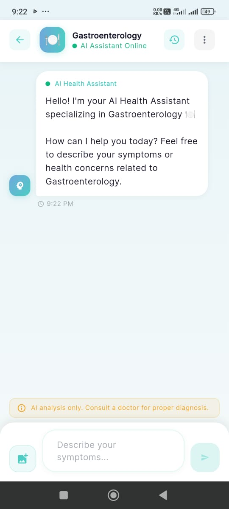

# 🩺 Pocket Doctor Ecosystem
### *AI-Powered Health Companion & Telehealth Platform*

[](https://flutter.dev/)
[](https://ai.google.dev/)
[](https://supabase.com/)
[](https://webrtc.org/)
[](https://dart.dev/)

---

## 🌟 Overview

**Pocket Doctor Ecosystem** is an enterprise-grade, dual-application telehealth platform designed to seamlessly connect patients with intelligent AI medical insights and verified healthcare professionals. 

The platform consists of two synchronized, dedicated Flutter applications connected via a unified **Supabase Cloud** infrastructure and a high-performance **WebRTC Real-time Telehealth Engine**:

1. 📱 **Pocket Doctor (Patient App)**: AI-driven symptom analysis, instant emergency response, realtime appointment scheduling, patient reviews, and live video consultations.
2. 👨‍⚕️ **Doctor Care (Doctor App)**: Clinical dashboard, realtime patient appointment request management, dynamic profile customization, patient feedback monitoring, and 1-on-1 telehealth video calls.

---

## 📸 Visual UI Showcase

| **Pocket Doctor (Patient App)** | **Doctor Care (Doctor App)** |
| :---: | :---: |
|  <br> *Home & Specialty Selection* |  <br> *Doctor Clinical Dashboard* |
|  <br> *Specialized Gemini AI Health Assistant* |  <br> *Appointment Requests & Schedule* |
|  <br> *Emergency Alert & Direct Action Screen* |  <br> *Doctor Profile & Availability Toggle* |
|  <br> *Doctor Discovery & Booking* |  <br> *Patient Ratings & Clinical Reviews* |
| .jpeg) <br> *Doctor Review & Ratings Submission* |  <br> *Realtime WebRTC Video Consultation* |

---

## ✨ Primary Features

### 📱 1. Pocket Doctor (Patient App)
* **🤖 Google Gemini AI Consultant**: Real-time context-aware medical analysis and preliminary health guidance powered by Google Gemini Pro.
* **🚨 Emergency Response System**: Direct-dial integration for immediate ambulance call dispatching and high-priority emergency alerts.
* **📅 Realtime Doctor Discovery & Booking**: Search verified doctors by specialty (Cardiology, Neurology, Pediatrics, etc.) and book consultation slots instantly.
* **📹 Peer-to-Peer Telehealth Calls**: Secure 1-on-1 WebRTC audio/video consultations directly with doctors.
* **⭐ Feedback & Review System**: Rate and review doctors after consultations to help build community trust.

### 👨‍⚕️ 2. Doctor Care (Doctor App)
* **📊 Clinical Dashboard**: Realtime stats tracking active appointments, total patients served, pending requests, and overall rating.
* **⚡ Live Appointment Management**: Accept, reschedule, or complete appointment requests in real-time with automated status sync.
* **📞 Integrated Telehealth Suite**: Incoming video call alerts with automatic audio routing to loudspeaker and low-latency HD video stream powered by TURN/STUN WebRTC servers.
* **👤 Dynamic Profile & Avatar System**: Cloud-synced profile customization with Supabase Storage for avatar uploads, availability toggle, and bio management.
* **💬 Review Insights**: Track and respond to patient ratings and reviews.

---

## 🏗 Platform Architecture & Tech Stack

```
                     ┌──────────────────────────────────────┐
                     │          Google Gemini API           │
                     └──────────────────┬───────────────────┘
                                        │ (AI Symptom Analysis)
                                        ▼
┌─────────────────────────┐   Realtime Signaling   ┌─────────────────────────┐
│     Pocket Doctor       │ ◄────────────────────► │       Doctor Care       │
│      (Patient App)      │      & Database        │       (Doctor App)      │
└────────────┬────────────┘                        └────────────┬────────────┘
             │                                                  │
             │           ┌────────────────────────┐             │
             └──────────►│  Supabase Cloud Engine │◄────────────┘
                         │ (PostgreSQL, Storage,  │
                         │  Realtime, Auth, RLS)  │
                         └───────────┬────────────┘
                                     │ (ICE Candidate Exchange)
                                     ▼
                         ┌────────────────────────┐
                         │   WebRTC P2P Stream    │
                         │ (OpenRelay TURN/STUN)  │
                         └────────────────────────┘
```

### Technology Matrix

| Layer | Component | Technology |
| :--- | :--- | :--- |
| **Mobile Apps** | Cross-Platform Client | Flutter (3.x) / Dart |
| **Backend & Database** | DB, Auth, Realtime, Storage | Supabase Cloud (PostgreSQL with RLS) |
| **AI Intelligence** | Medical AI Model | Google Gemini Pro API |
| **Video Telehealth** | P2P Video/Audio | `flutter_webrtc` + OpenRelay Metered TURN |
| **State Management** | Application State | Provider Architecture |
| **Local Storage** | Device Caching | `shared_preferences` & `flutter_secure_storage` |

---

## 📂 Repository Structure

```
Pocket-Doctor-Your_Ai_Health_Companion-/
├── Pocket-Doctor/              # 📱 Patient Mobile App (Flutter)
│   ├── lib/
│   │   ├── core/               # AI Services, Supabase Client, WebRTC Engine
│   │   ├── features/           # Auth, AI Chat, Doctor Booking, Telehealth
│   │   └── main.dart
│   └── pubspec.yaml
│
├── doctor_care/                # 👨‍⚕️ Doctor Mobile App (Flutter)
│   ├── lib/
│   │   ├── core/               # Doctor Auth, Supabase Services, WebRTC Receiver
│   │   ├── features/           # Dashboard, Appointments, Profile, Reviews, Call
│   │   └── main.dart
│   └── pubspec.yaml
│
└── Ui/                         # 🖼 Visual Design Assets & Screenshots
    ├── Pocket doctor Home.jpeg
    ├── Doctor dashboard.jpeg
    ├── join live session.jpeg
    └── ...
```

---

## 🚀 Getting Started

### Prerequisites
- [Flutter SDK](https://docs.flutter.dev/get-started/install) (v3.24.0 or higher)
- Android Studio / VS Code with Flutter extensions
- Java JDK 17+ and Android SDK 34+
- Supabase Account & Project
- Google Gemini API Key

---

### Setup & Installation

#### 1. Clone the Repository
```bash
git clone https://github.com/Aiman-Al-Mahmud/Pocket-Doctor-Your_Ai_Health_Companion-.git
cd Pocket-Doctor-Your_Ai_Health_Companion-
```

#### 2. Configure Environment Variables
Create a `.env` file in the root of **Pocket-Doctor**:
```env
GEMINI_API_KEY=your_gemini_api_key_here
SUPABASE_URL=https://your-supabase-project.supabase.co
SUPABASE_ANON_KEY=your_supabase_anon_key
```

Configure Supabase credentials in **doctor_care** (`lib/core/services/supabase_service.dart`).

---

### Running the Applications

#### 📱 Run Patient App (Pocket Doctor)
```bash
cd Pocket-Doctor
flutter pub get
flutter run
```

#### 👨‍⚕️ Run Doctor App (Doctor Care)
```bash
cd doctor_care
flutter pub get
flutter run
```

---

### Building Release APKs

#### Build Patient App Release APK:
```bash
cd Pocket-Doctor
flutter build apk --release --no-tree-shake-icons
```

#### Build Doctor App Release APK:
```bash
cd doctor_care
flutter build apk --release --no-tree-shake-icons
```

---

## 🔒 Security & Privacy
- **Row Level Security (RLS)**: Database tables enforce strict user role isolation so patients and doctors can only access authorized clinical records.
- **Encrypted Media Storage**: User avatars and medical files are stored in isolated Supabase Storage buckets with explicit access policies.
- **Secure WebRTC Signaling**: Peer Connection candidate exchanges use ephemeral signaling tables cleaned up automatically upon call termination.

---

## ⚠️ Disclaimer
*Pocket Doctor is an AI-assisted health platform designed for preliminary informational guidance and telehealth connectivity. It is not intended to replace professional medical diagnosis, emergency services, or in-person physician evaluations.*

---
<p align="center">
  Made with ❤️ by <b>Aiman Al Mahmud</b>
</p>
